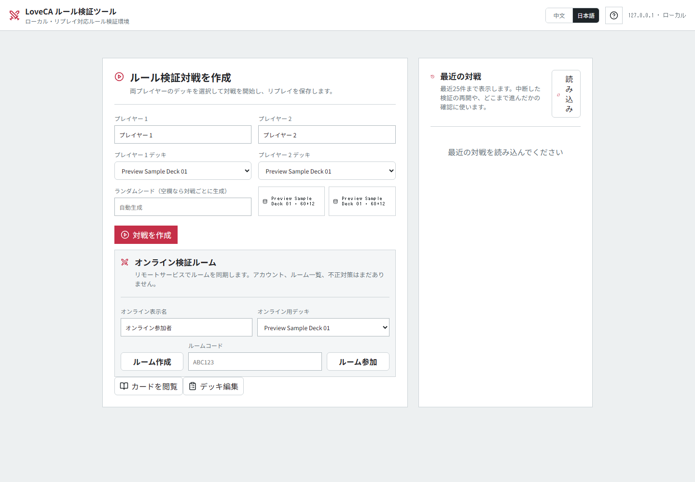
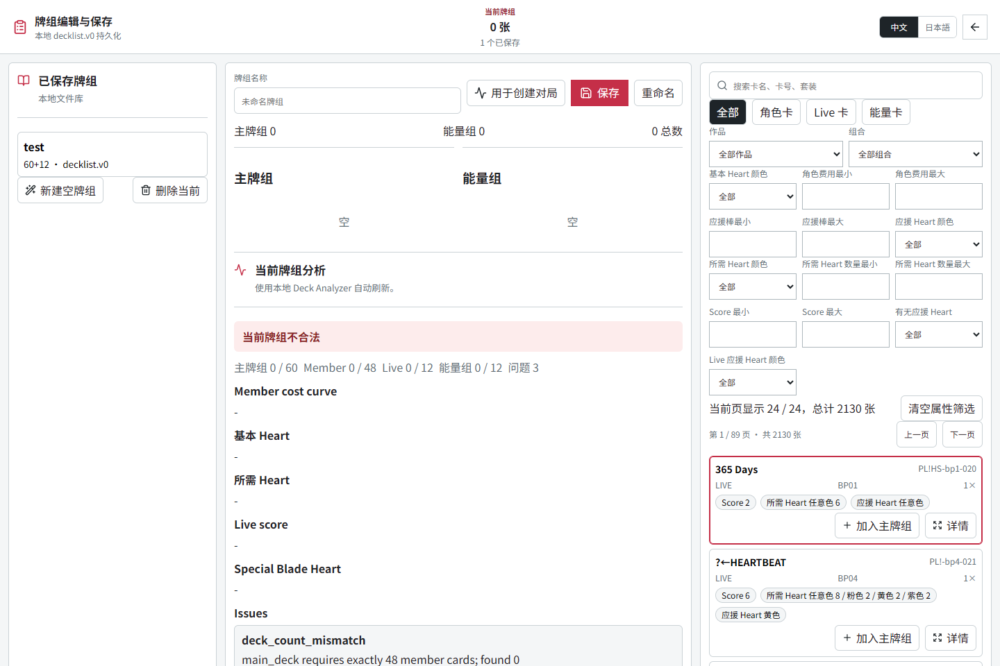
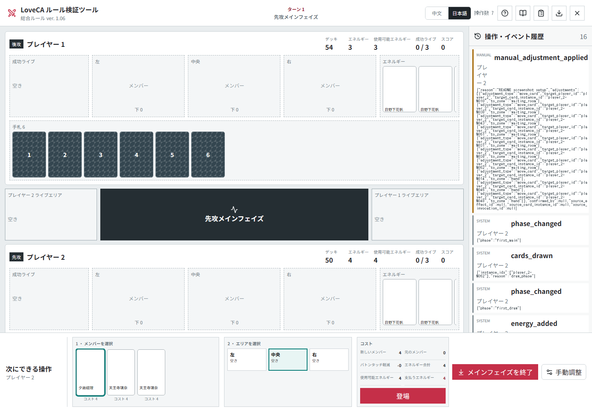

# Love Live! Series Official Card Game Analysis & Simulation Platform

[日本語](./README.md) | [简体中文](./README.zh-CN.md)

这是一个面向 Love Live! Series Official Card Game（ラブカ）的本地卡牌数据库、牌组分析与规则验证工具。

项目始终以官方日文资料为唯一权威来源。内部英文标识只用于工程实现，不替代官方日文术语。

## 当前状态

`v0.4.2-alpha.1` 当前已收录:

- 正式官方 `card_list` 卡牌 importer
- 避免 `＋` / `+` 混用的卡号正规化
- SQLite Schema v2 本地卡牌数据库
- 带本地保存能力的 Deck Builder
- 基于 `decklist.v0` 的 Deck Analyzer
- FastAPI + React SPA 可视化规则验证器
- 可回放的 Action-only GameState
- 925 条 effect registry entry
  - 392 条为 `test_validated_executable`
  - 533 条为 timing prompt / 未支持处理用 `manual_resolution`
- 面向未来低成本 online 同步的 state hash / compatibility metadata 基础

当前开发主线:

- Roadmap 上当前集中在 Phase 5 Effect DSL / 结构化技能执行。
- Phase 1 / 2 / 3 已基本实现，进入维护和改善阶段。
- Phase 4 的 Human-vs-Human 验证器和 Phase 7 的 UI 已提前完成大部分。
- Phase 9 / 10 的低成本 online 验证会和 Phase 5 并行提前推进。
- Simple AI、AI-vs-AI、Monte Carlo 和胜率引擎已降为最低优先级。

当前规则验证器已覆盖:

- 先后攻、起手、调度、初始 Energy
- Member 登场、满位替换、`バトンタッチ`
- Live Set、等量补抽、Live 公开、应援
- Heart 分配、部分特殊 Blade Heart 自动处理
- 成功 Live 移动、下一回合先攻判定、3 张成功 Live 胜负
- 少量技能支持包含手牌 / Energy / Stage Member / Heart 颜色 / 牌堆顶检查的限定结构化 prompt
- 部分双方都需要选择的效果已可通过 multi-player pending choice 顺序处理
- `test_validated_executable` 覆盖率按当前本地卡池粗略全技能数量计算已达到 20.07%
- 暂不能自动执行的技能通过 `ManualAdjustmentAction` 补充
- 无法处理的技能可以用调试用 `effect_skipped_due_to_error` 显式记录后跳过

Deck Builder 当前状态:

- 创建、读取、更新、删除本地保存牌组
- 按 `Member` / `Live` / `Energy` 分区显示已组牌组
- 检查 `Member 48` / `Live 12` / `Energy 12` 的构筑数量
- 按作品、组合、Heart 颜色、Blade、Live 所需 Heart、Score、Blade Heart 筛选
- 在卡牌详情弹窗中选择印刷版本并确认卡图
- 通过 dashboard 查看 cost、Heart、score、特殊 Blade Heart 与技能时点统计

当前还没有:

- 全卡技能自动执行
- 面向全量卡池的完整技能提示覆盖
- AI、Monte Carlo、胜率引擎
- 在线对战、账户和同步

## 已知限制

- 还没有覆盖全卡技能自动执行。
- 当前 broad prompt coverage 大量包含 timing-only manual fallback。
- 依赖 FAQ 或个别裁定的效果尚未规格化。
- 当 importer、parser、卡号正规化、SQLite schema 或 effect registry 兼容性相关内容发生更新后，不建议继续复用旧的 `data/loveca.sqlite3`，应通过官方 importer 重建或重新导入卡牌数据库。保存牌组是 `decklist.v0` 用户数据，可以和卡牌数据库分开保留。
- Web/API 测试依赖 `httpx2`。环境缺少该依赖时，`tests/test_catalog_api.py` 和 `tests/test_webapp.py` 会在收集阶段停止。

## 界面预览

启动页：可直接选择已保存牌组并创建对局。



Deck Builder：右侧筛选选卡，中央查看构筑与分析结果。



规则验证器：同屏查看盘面、Action/Event Log 与人工规则调整。



## 环境要求

- Python `3.11+`
- Node.js `20` / `22` / `24+`
- SQLite 无需额外安装

安装依赖:

```powershell
python -m pip install -e ".[dev]"
cd web
npm install
cd ..
```

## 本地启动

1. 初始化卡牌数据库。

```powershell
loveca cards init --database data/loveca.sqlite3
```

版本更新后如果 importer / parser / schema 有变化，请先备份或删除旧的 `data/loveca.sqlite3`，再按本流程重建卡牌数据库。继续使用旧 DB 可能导致卡号、图片、effect registry 或 online compatibility fingerprint 不一致。

2. 从官网抓取卡牌并生成本地规范化产物。

```powershell
loveca cards import-official `
  --output-root data/imports/official `
  --delay 1
```

3. 将规范化产物导入 SQLite。

```powershell
loveca cards import `
  --database data/loveca.sqlite3 `
  --input data/imports/official/normalized/cards-official.json `
  --normalization data_sources/card-entity-normalization.json `
  --report logs/import-full.md
```

4. 构建前端。

```powershell
cd web
npm run build
cd ..
```

5. 如需牌面图片，先缓存官方图片。

```powershell
loveca cards cache-images `
  --database data/loveca.sqlite3 `
  --cache-dir data/card_images `
  --delay 1
```

6. 启动 Web UI。

```powershell
loveca web serve `
  --database data/loveca.sqlite3 `
  --matches data/matches.sqlite3 `
  --image-cache data/card_images `
  --host 127.0.0.1 `
  --port 8765
```

浏览器访问 <http://127.0.0.1:8765>。

如果 `8765` 已被占用，可以改成 `--port 8766`。

## 卡牌 DB 与 asset 分发方针

长期来看，可以提供包含预构建 SQLite 卡牌数据库、effect registry、manifest 和 checksum 的版本化 asset package，让用户无需每次从官网全量抓取即可直接启动。

但官方卡图、官方效果文本和官方 PDF 派生的大量数据涉及再分发边界。在权利确认前，公开 asset 更适合只包含应用本体、schema、importer、manifest、checksum 和项目自有 metadata；卡牌 DB 与图片 cache 优先由用户本地 importer 从官方来源构建。

如果向 private tester 提供预构建 DB，也应明确 release version、schema version、parser version、card database fingerprint 和 effect registry hash。任何破坏兼容性的版本更新后，都需要重新导入。

## 常用命令

牌组分析:

```powershell
loveca decks analyze `
  --database data/loveca.sqlite3 `
  --deck data/decks/your-deck.json `
  --output text
```

按补充包增量导入:

```powershell
loveca cards import-official `
  --output-root data/imports/official-bp06 `
  --mode incremental-set `
  --card-set BP06 `
  --delay 1
```

```powershell
loveca cards import `
  --database data/loveca.sqlite3 `
  --input data/imports/official/normalized/cards-official.json `
  --normalization data_sources/card-entity-normalization.json `
  --card-set BP06 `
  --report logs/import-bp06.md
```

## 测试

Python:

```powershell
python -m pytest
```

AI sandbox 的 20 deck x 20 match 黑盒 smoke 已纳入 pytest。
没有本地正式卡牌数据库的环境会自动 skip。需要单独生成审查报告时:

```powershell
$env:PYTHONPATH="src;."
python -m tools.ai_sandbox.blackbox_playtest `
  --database data/loveca.sqlite3 `
  --output logs/ai_sandbox/manual-run `
  --decks 20 `
  --matches 20 `
  --manual-policy block
```

使用 `--manual-policy skip` 时，未支持的强制技能会记录为
`effect_skipped_due_to_error` 后继续推进。这个能力只用于规则调试，
不是正式技能结算。

前端:

```powershell
cd web
npm run test -- --run
npm run build
```

## 变更记录

每个版本的详细变更见 [CHANGELOG.md](./CHANGELOG.md)。

## 目录概览

- `TODO.md`: 低优先级待办
- `src/loveca/cards/`: importer、catalog、图片缓存
- `src/loveca/decks/`: 牌组格式、分析器、本地牌组库
- `src/loveca/simulation/`: GameState、Action、runtime、effects
- `src/loveca/webapp.py`: FastAPI 与 SPA 分发
- `web/`: React 规则验证 UI
- `docs/`, `specs/`: 架构文档与规格
- `docs/14-database-migration-and-update-guide.md`: SQLite 重建、增量更新和 runtime 生命周期指引
- `docs/15-project-guidance.md`: changelog 语言等维护指引
- `docs/16-low-cost-online-battle-plan.md`: 低成本网络双人规则验证模式规划


