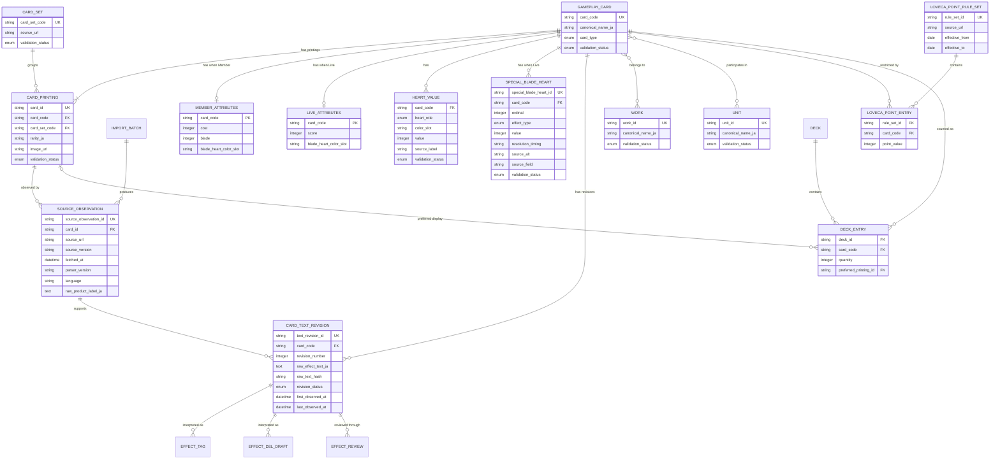

# Card Data ERD

## 1. Purpose

This document visualizes the frozen logical card-data model defined by [018 Card Data Storage](../specs/018-card-data-storage.spec.md).

It is an architecture artifact, not a SQL schema. Optionality and constraints described below must be carried into the future database implementation specification.

## 2. Identity Boundary

The model separates:

* Gameplay Card: rule identity, keyed by `card_code`
* Card Printing: rarity, illustration, and release identity, keyed by full official `card_id`
* Card Instance: one runtime copy in a match, outside the canonical card database

Deck construction, legality, rules, attributes, text revisions, and effects use Gameplay Card identity. Image and printing preferences use Card Printing identity.

## 3. Logical ERD

The Work and Unit association records are omitted as named boxes for readability. Their logical records must preserve `card_code`, normalized entity ID, raw Japanese label, and Source Observation.

## 4. Cardinality and Ownership

| Relationship | Required rule |
| --- | --- |
| Gameplay Card -> Card Printing | One-to-many; a source-confirmed Gameplay Card has at least one printing. |
| Card Set -> Card Printing | One-to-many; every imported printing belongs to one reviewed card-list grouping. |
| Gameplay Card -> Member Attributes | Zero-or-one; present only when `card_type = member`. |
| Gameplay Card -> Live Attributes | Zero-or-one; present only when `card_type = live`. |
| Gameplay Card -> Heart Value | Zero-to-many; role and color constraints depend on card type. |
| Gameplay Card -> Special Blade Heart | Zero-to-many; Live only. |
| Gameplay Card -> Card Text Revision | Zero-to-many; at most one current revision. |
| Card Text Revision -> derived effect records | One-to-many; interpretations always identify their source revision. |
| Gameplay Card -> Work / Unit | Many-to-many; raw official labels and provenance remain attached. |
| Gameplay Card -> Loveca Point Entry | One-to-many across versioned rule sets. |
| Deck Entry -> Gameplay Card | Required; legality and quantity use `card_code`. |
| Deck Entry -> Card Printing | Optional preferred display printing only. |

## 5. Cross-Product Mapping Exercise

The v0.3 review artifact at `data_samples/normalized/cards-cross-product-sample.json` maps as follows:

| Review fact | Logical mapping |
| --- | --- |
| 30 normalized records | 30 sampled Card Printing records |
| 30 distinct `card_code` values | 30 sampled Gameplay Card records |
| `BP01`, `BP03`, `BP06`, `PLSD01`, `HSSD01`, `PR` | 6 Card Set records |
| 12 Member records | 12 Member Attributes owners |
| 12 Live records | 12 Live Attributes owners |
| 6 Energy records | No Member or Live attribute records |
| 11 records with related printing links | Evidence for one Gameplay Card to many Card Printings |
| `ALL1`, `スコア1` | Structured Special Blade Heart records |
| `作品名`, `参加ユニット` | Work and Unit normalization candidates plus raw source labels |
| `収録商品` | Source Observation raw field only |

The sample includes one selected printing per sampled `card_code`. The official related-printing IDs provide evidence for additional Card Printing records without requiring rule data duplication.

## 6. Validation Walkthrough

The future implementation must be able to demonstrate:

1. Every sampled full `card_id` resolves to exactly one `card_code`.
2. Every sampled printing resolves to one of the six requested Card Sets.
3. Printing rarity and image data do not appear on Gameplay Card.
4. Member and Live attributes are stored once per Gameplay Card.
5. Energy cards have no type-specific attribute extension.
6. `heart0` cannot appear as a Member basic Heart.
7. Special Blade Hearts cannot belong to Member or Energy cards.
8. Work and Unit normalization never discards the raw Japanese source label.
9. Effect Tags and DSL records identify a Card Text Revision and its hash.
10. A Deck Entry preferred printing resolves back to the same Gameplay Card.
11. Loveca Point values resolve to Gameplay Card under a versioned rule set.

## 7. Current SQLite Migration Map

This is planning guidance only. No migration is performed in this documentation phase.

| Current prototype structure | Target logical structure | Migration concern |
| --- | --- | --- |
| `products` | Card Set | Existing records must be reviewed; `収録商品` must not be promoted automatically. |
| `cards.card_number` | Gameplay Card `card_code` plus Card Printing `card_id` | Existing values may contain either identity and require classification. |
| `cards.product_id` | Card Printing -> Card Set | Product ownership moves away from rule identity. |
| `cards.name`, `cards.card_type` | Gameplay Card | Equivalent printings must agree before consolidation. |
| `cards.raw_effect_text` | Card Text Revision | Hash text and preserve source observation before deduplication. |
| `cards.image_url` | Card Printing | Image remains printing-specific. |
| `member_card_attributes` | Gameplay Card Member Attributes | Re-key after resolving `card_code`. |
| `live_card_attributes` | Gameplay Card Live Attributes | Re-key after resolving `card_code`. |
| `card_heart_values` | Gameplay Card Heart Value | Validate role/card-type and `heart0` constraints. |
| `card_effect_tags` | Card Text Revision Effect Tag | Tags require text revision provenance. |
| `card_raw_sources` | Source Observation | Source rows attach to Card Printing and preserve raw product labels. |
| `card_point_restrictions` | Rule Set plus Point Entry | Resolve to `card_code` and preserve effective policy history. |
| `import_logs` | Import Batch | Preserve existing audit history where possible. |

The future migration specification must define conflict handling for printings whose normalized rule data differs under the same `card_code`. Such conflicts must stop automatic consolidation and require review.

## 8. Deferred Decisions

The following remain outside this freeze:

* SQL column types and surrogate-key strategy
* migration execution and backward compatibility
* Work and Unit tokenization dictionaries
* public export projections
* full Product catalog modeling beyond Card Set
* full effect tables and executable implementation storage
