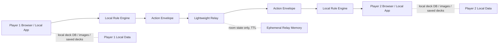

# Low-Cost Online Battle Plan

## 1. Purpose

This document defines the planning direction for a low-cost online battle mode.

The product goal is to collect more human playtest feedback as early as possible without building a full live-service platform. The technical goal is to extend the current local two-player rule verifier into a network two-player mode while keeping the rule engine local.

User data should remain local. The online layer should not introduce accounts, cloud deck storage, cloud card libraries, ranked identity, or authoritative rule judgment.

This is a planning document only. It does not define implementation code, database migrations, deployment scripts, or final API schemas.

## 2. Core Decision

The first online mode should not be a full authoritative game server.

Instead, the first online mode should use:

* local rule engines on both players' machines
* deterministic GameState serialization
* deterministic random seed handling
* serialized Actions
* state snapshot hashes
* a lightweight network relay

The relay should coordinate rooms and forward protocol messages. It should not need the full official card database, card images, raw official card text, or card effect execution logic.

The relay should also avoid storing user decks, player profiles, match history, or permanent personal data.

This keeps operating cost low and allows online testing before the rule engine is complete enough for a trusted authoritative service.

The online prototype does not need to wait for all local phases to be complete. It may start while card import, Deck Builder, effect execution, and rule coverage are still improving, as long as compatibility checks and replay-safe Action logs protect users from silent divergence.

The browser-side rule runtime is specified separately in [021 Browser Engine and Local-Rule Online](../specs/021-browser-engine-and-local-online.spec.md). That spec is the required bridge between the current Python reference engine and the future low-cost relay model.

## 3. Architecture Summary

The target architecture has three participants:

* Player 1 client
* Player 2 client
* lightweight relay service

Each client runs the same local application stack:

* card database
* deck validation
* GameState model
* Rule Engine
* LegalActionGenerator
* Action resolver
* replay/export tooling

The relay owns only:

* room lifecycle
* peer connection state
* protocol message forwarding
* temporary message buffering for reconnects
* optional short-lived audit metadata

The relay must not become the source of rules truth in this phase.



## 3A. Minimal Relay Responsibilities

The relay should do only what is necessary for two clients to find each other and exchange messages.

Relay responsibilities:

* create short-lived private rooms
* accept one host and one guest connection
* assign or confirm player seats
* verify basic protocol envelope shape
* forward messages to the other connected peer
* buffer recent messages for reconnect within room TTL
* send heartbeat and disconnect notices
* enforce message size and rate limits
* expire idle rooms

Relay non-responsibilities:

* no user accounts
* no login
* no friend list
* no matchmaking
* no deck storage
* no cloud card database
* no card image hosting
* no official text hosting
* no rule validation
* no Action legality judgment
* no random shuffle authority
* no hidden-information enforcement
* no anti-cheat guarantee
* no permanent match history
* no ranking or tournament state

If a feature requires the relay to understand official card data or game rules, it should be deferred or kept local.

## 3B. Local Client Responsibilities

Each local client remains a complete simulator instance.

Client responsibilities:

* load local card database
* load local saved decks
* validate deck legality locally
* create or verify initial MatchState
* run Rule Engine
* run LegalActionGenerator
* resolve Actions
* maintain runtime SQLite for local match state
* calculate canonical state hashes
* keep local replay logs
* export local divergence bundles
* display card images from local cache
* handle ManualAdjustmentAction locally and synchronize it as an Action

The client should treat the network as a transport for already-structured simulator messages, not as a remote rules service.

## 3C. Data Locality Model

Persistent data should stay on the user's machine.

Local persistent data:

* official card SQLite database
* card image cache
* saved decks
* local runtime match database
* replay exports
* divergence report bundles
* local user display preferences

Relay data:

* room id
* room code
* connected socket ids
* player seat mapping
* protocol version
* recent message buffer
* last heartbeat timestamps
* optional short-lived room diagnostics

Relay data should be deleted automatically when the room expires. The first version should not require backups.

## 3D. Required Client-Side Architecture Pieces

The current local architecture should gain a thin online adapter rather than a separate online engine.

Planned client-side pieces:

* `ProtocolCodec`: validates and serializes versioned online messages.
* `RelayClient`: owns WebSocket connection, reconnect, and message delivery.
* `OnlineMatchController`: turns local legal choices into Action envelopes and applies remote Action envelopes.
* `CompatibilityChecker`: compares protocol, app, rule, database, registry, and deck fingerprints.
* `CanonicalStateHasher`: produces deterministic MatchState hashes.
* `DivergenceRecorder`: exports local debugging bundles when synchronization fails.
* `NetworkPresenceState`: stores connection status, peer status, room code, and reconnect state for UI only.

These pieces should sit outside the Rule Engine. The Rule Engine should not know whether an Action came from local UI, CLI, replay, AI, or network.

## 3E. Controller Boundary

The controller model should support both local and online play through the same Action boundary.

Local single-machine mode:

* `HumanController` receives choices from local UI.
* The local app submits selected Actions to the local Action resolver.

Online mode:

* the local player's `HumanController` still chooses from LegalActionGenerator output
* `OnlineMatchController` wraps the selected Action in an Action envelope
* the local client applies the Action locally
* the relay forwards the Action envelope to the peer
* the peer validates and applies the same Action locally

Remote player input should not be represented as a different kind of game rule. It is the same serializable Action with a different transport source.

## 4. Relationship to Future Authoritative Server

This plan does not reject a future authoritative server.

The project should treat online play as two tracks:

* near-term low-cost synchronized local-engine play
* long-term server-authoritative online play

The near-term track is for rules testing, manual validation, and feedback collection. It has lower anti-cheat guarantees but much lower cost and faster delivery.

The long-term track remains the correct direction for competitive play, public matchmaking, rankings, tournaments, and stronger abuse prevention.

All protocol work in the low-cost track should preserve a path toward the authoritative-server track by keeping Actions, GameState snapshots, random seeds, and replay records cleanly serialized.

Advanced AI is not a prerequisite for online play. For this project, human online testing is now a higher-priority feedback loop than AI-vs-AI or win-rate simulation.

## 5. Trust Model

The low-cost mode is not cheat-resistant.

Both clients independently validate every received Action against local GameState and the local Rule Engine. This catches ordinary desynchronization and invalid Actions, but it does not prevent a modified client from lying about private information or refusing to follow the intended UX.

This is acceptable for the first online testing mode because the primary goal is human rule validation, not ranked play.

The UI should label this mode as a testing or rule verification mode, not as competitive online play.

## 6. Rule Engine Boundary

The same rule boundaries used by local play remain mandatory online:

* UI must not directly mutate GameState.
* All state changes must be represented by serializable Actions.
* Manual resolution must produce structured replay-safe Actions.
* LegalActionGenerator owns the list of currently legal player choices.
* Effect triggers must be generated by the Rule Engine, not inferred by the UI.
* Randomness must be deterministic from the agreed seed context.

The network layer is allowed to transport Actions and snapshots. It is not allowed to invent game rules.

## 7. Protocol Direction

The first protocol should be a versioned JSON protocol, tentatively named `loveca-online.v0`.

Every network message should use a common envelope:

```json
{
  "protocol_version": "loveca-online.v0",
  "message_id": "uuid",
  "room_id": "room-code-or-uuid",
  "match_id": "match-id",
  "sender_player_id": "player-1",
  "sent_at": "2026-06-15T00:00:00Z",
  "kind": "action_submit",
  "payload": {}
}
```

The protocol should be documented before implementation in a dedicated specification, likely `specs/021-online-battle-protocol.spec.md`.

Because `021` is now assigned to the browser engine and local-rule online foundation, the dedicated relay protocol specification should use the next available spec number when it is created.

The protocol should be transport-light. WebSocket is the preferred transport, but the message model should not depend on browser-specific behavior.

Minimal relay endpoints should be enough:

```text
POST /rooms
GET  /rooms/{room_code}
GET  /rooms/{room_code}/socket
```

`POST /rooms` creates a short-lived room and returns a room code. `GET /rooms/{room_code}` returns basic room status. The WebSocket endpoint carries all match and synchronization messages.

No endpoint should be needed for user profiles, deck uploads, card database browsing, card image fetches, rankings, or match history.

## 8. Required Message Families

The low-cost protocol should cover these message families.

Room lifecycle:

* `room_create`
* `room_created`
* `room_join`
* `room_joined`
* `room_closed`

Compatibility:

* `compatibility_offer`
* `compatibility_report`
* `compatibility_rejected`

Match setup:

* `match_proposal`
* `match_accept`
* `match_reject`
* `match_seed_commit`
* `match_started`

Action flow:

* `action_submit`
* `action_ack`
* `action_reject`
* `action_applied`

State synchronization:

* `snapshot_digest`
* `snapshot_request`
* `snapshot_response`
* `divergence_report`

Connection health:

* `heartbeat`
* `disconnect_notice`
* `reconnect_request`
* `reconnect_accepted`
* `reconnect_rejected`

Manual verification:

* `manual_pause`
* `manual_resume`
* `debug_note`

The relay should treat `kind` as routing metadata only. It may reject unknown or oversized message kinds, but it should not inspect game-rule meaning inside `payload`.

## 9. Action Envelope

The online protocol should send player and system choices as Action envelopes, not as UI commands.

An Action envelope should include:

```json
{
  "action_id": "uuid-or-deterministic-id",
  "player_id": "player-1",
  "expected_revision": 42,
  "base_state_hash": "sha256...",
  "action_type": "resolve_effect",
  "payload": {},
  "client_timestamp": "2026-06-15T00:00:00Z"
}
```

The receiving client must reject or pause on an Action when:

* `expected_revision` does not match current GameState revision
* `base_state_hash` does not match current GameState hash
* the Action is not present in LegalActionGenerator output
* the Action payload fails validation
* the local Action resolver produces a different resulting snapshot hash than expected

The relay should not decide whether the Action is legal. Only clients decide whether an Action is legal by using their local Rule Engine and LegalActionGenerator.

## 10. State Hash and Snapshot Rules

State comparison requires a deterministic canonical representation.

The state hash should be based on canonical serialized MatchState, including:

* rule version
* MatchState revision
* turn number
* phase
* player states
* zones
* card instance identifiers
* pending choices
* pending effects
* active modifiers
* action/event sequence references needed for replay

The hash should exclude:

* UI selection state
* animations
* local panel layout
* image cache paths
* local-only debug display preferences

When a hash mismatch occurs, the match should pause immediately and create a divergence report instead of attempting automatic repair.

## 11. Compatibility Handshake

Before starting a network match, both clients should exchange compatibility metadata:

* application version
* protocol version
* rule version
* card database fingerprint
* effect registry version
* effect registry hash
* decklist hashes
* normalized terminology version, if available
* supported manual-resolution action families

The image cache is not part of compatibility. Missing images should only affect display fallback.

If compatibility fails, the UI should clearly show which fingerprint differs and prevent match start.

Compatibility should be strict by default. A permissive "try anyway" mode may be useful for developers, but it should be hidden behind an explicit debug setting because mismatched card databases or effect registries can create false rules bugs.

## 12. Deck and Card Data Policy

The relay should not distribute official card data.

Online setup should exchange only:

* decklist data using `card_code`
* optional `preferred_printing_id`
* deck hashes
* local database fingerprints
* minimal card identifiers required for validation

Official Japanese card names, text, images, and source observations remain local data under the existing source policy.

This reduces copyright risk and keeps the relay lightweight.

Recommended deck exchange model:

* player selects a local saved deck
* client sends deck hash and deck summary to peer
* peer checks whether all referenced `card_code` values exist locally
* if local database can resolve the deck, match can continue
* if not, UI reports missing cards and blocks match start

The first version may exchange full `decklist.v0` content peer-to-peer through the relay because decklists are user-created configuration, not official card data. This should still be treated as transient room data and not stored permanently by the relay.

## 12A. Server Storage Lifecycle

The relay should be designed around short-lived state.

Room lifecycle:

* room is created with a random room code
* room waits for guest connection
* room starts when both peers complete compatibility handshake
* room remains active while peers heartbeat
* room enters reconnect grace period after disconnect
* room expires after TTL or explicit close
* room state and message buffer are deleted

Recommended first-version retention:

* room without guest: 15 minutes
* active room idle timeout: 30 minutes
* reconnect grace period: 5 minutes
* recent message buffer: last 100 to 300 protocol messages
* no permanent database required

If optional relay diagnostics are stored, they should be metadata only:

* room created time
* room closed time
* close reason
* message counts
* protocol versions
* error categories

Diagnostics should not store deck contents, official card text, card images, full snapshots, or user identifiers.

## 12E. Local Bootstrap Asset Packages

The online relay should not solve card database initialization.

To keep online play cheap, onboarding should be handled by local installation and static asset distribution instead of relay-side data services.

Long-term target:

* user installs or downloads the app
* user downloads a versioned bootstrap asset package from static hosting or CDN
* app verifies checksums and package version
* app installs the local SQLite card database, effect registry, manifests, and approved cache artifacts
* user can run Deck Builder, local battle, and network battle without a live card data server

Possible package contents:

* application release artifacts
* schema version metadata
* importer/parser version metadata
* card database fingerprint manifest
* effect registry snapshot
* terminology normalization files
* deck format examples that contain no bulk official text
* optional prebuilt SQLite database if redistribution is approved
* optional image cache archive if redistribution is approved
* official source URL manifest and local importer instructions when redistribution is not approved

The CDN should be a static file host only. It should not store user accounts, saved decks, match data, replay logs, or runtime state.

Public packaging must follow the source policy:

* project-owned code and metadata are safe candidates
* user-owned deck data must remain local
* official card images and full official text require redistribution review
* when rights are unclear, prefer local import from official sources over public CDN redistribution

This asset-bootstrap track reduces setup friction for testers without increasing relay complexity.

Preferred near-term setup:

* user installs the app
* app runs local official importer or local update command
* app caches card database and images locally
* app records database and registry fingerprints
* online match start is allowed only when both peers pass compatibility checks

Static/CDN asset packages are a later convenience path. They should not replace the local importer as the primary safe path unless redistribution rights are resolved.

## 12F. Incremental Update and Backward Compatibility

Online play will be useful only if users can update frequently without breaking local data.

Required update properties:

* local card importer supports incremental updates by Card Set or official source scope
* local update process preserves saved decks
* local update process preserves replay exports
* runtime match data can be discarded or pruned without affecting saved decks
* card database fingerprints change predictably after updates
* effect registry versions and hashes are visible to users
* older replay bundles keep the registry and compatibility metadata needed to explain past behavior
* match start is blocked when peers have incompatible rule, card, deck, or registry fingerprints

The online relay should not auto-update clients. Updates remain a local app responsibility.

This allows testers to keep participating while the engine changes quickly, without turning the relay into a patch server or user data service.

## 12B. Network Match Startup Flow

Recommended startup sequence:

1. Host creates a room.
2. Relay returns a room code.
3. Guest joins with the room code.
4. Both clients exchange compatibility metadata.
5. Both clients exchange deck hashes and local deck summaries.
6. Host proposes match settings: player names, seed policy, selected decks, rule version.
7. Guest accepts or rejects.
8. Both clients construct the same initial MatchState.
9. Both clients calculate initial state hash.
10. Match starts only if both initial hashes match.

If initial hashes differ, the match must not start. The UI should show a compatibility or setup mismatch instead of trying to recover automatically.

## 12C. Turn and Action Synchronization Flow

Recommended Action sequence:

1. Current player selects a legal Action locally.
2. Local client validates Action against current revision.
3. Local client applies Action and calculates resulting state hash.
4. Local client sends `action_submit` with base and resulting hashes.
5. Relay forwards the Action envelope.
6. Peer validates base revision and base hash.
7. Peer applies Action locally.
8. Peer compares resulting hash.
9. Peer sends `action_ack` or `action_reject`.
10. Both clients continue only after the Action is acknowledged or a debug setting allows optimistic continuation.

For the first implementation, conservative lockstep is preferable to optimistic prediction. The UX may be less smooth, but desync diagnosis is simpler.

## 12D. Failure Handling

The first online mode should prefer safe pause over automatic repair.

Failure cases:

* peer disconnects
* room expires
* protocol version mismatch
* compatibility mismatch
* stale revision
* base state hash mismatch
* resulting state hash mismatch
* invalid Action payload
* unsupported manual hidden-information flow

Default response:

* pause the match
* show a clear reason
* preserve local replay/action log
* offer divergence bundle export when applicable
* allow reconnect only when hashes can be restored

The first version should not attempt to merge divergent states.

## 13. Manual Resolution Online

Manual resolution remains necessary while effect coverage is incomplete.

Online manual resolution must follow the same replay-safe model as local play:

* manual changes must be structured Actions
* manual changes must be validated before application
* manual changes must be synchronized through the same Action protocol
* both clients must apply the same ManualAdjustmentAction
* note-only annotations must not change GameState

If a manual adjustment affects hidden information, the protocol must explicitly encode the visibility policy.

For the first online mode, complex hidden-information manual effects may be blocked or require both players to accept the manual result before continuing.

## 14. Reconnect and Resume

The first online relay should support basic reconnect, not permanent cloud persistence.

Recommended minimum behavior:

* room has a short TTL
* relay buffers recent protocol messages
* reconnecting client sends last known revision and state hash
* relay or peer sends missing Action envelopes
* client replays missing Actions locally
* if hashes match, match resumes
* if hashes differ, match pauses with divergence report

The relay does not need to store full official card data or full game snapshots for this phase.

## 15. Divergence Report

When online synchronization fails, the system should produce a local bug report bundle.

The bundle should include:

* protocol version
* app versions
* rule version
* card database fingerprints
* effect registry hashes
* deck hashes
* random seed context
* action log
* event log
* last matching revision
* first mismatching revision
* both state hashes
* optional sanitized snapshots

This is the main value of low-cost online testing: it should make real human desyncs reproducible for engine fixes.

## 16. Relay Deployment Model

The first relay should be cheap to run.

Recommended constraints:

* WebSocket-first communication
* optional HTTP polling fallback only if needed
* no account system in the first version
* private rooms by room code
* room TTL and idle cleanup
* low memory footprint
* optional SQLite event metadata for diagnostics
* no card image hosting
* no official card text hosting
* simple rate limiting

This should be deployable on a small VPS or a low-cost container platform.

## 17. Security and Abuse Boundaries

The first online mode should include basic operational protections:

* random room codes
* room TTL
* message size limits
* per-IP rate limits
* protocol version checks
* same-room sender validation
* no arbitrary file upload
* no public card data export

It should not claim:

* anti-cheat guarantees
* ranked integrity
* verified identities
* tournament readiness
* authoritative dispute resolution

## 18. MVP Implementation Stages

The online stages can begin before every Phase 1-7 item is complete. The minimum requirement is not full rule coverage; it is safe synchronization, local update compatibility, and clear unsupported-rule handling.

### Stage 0: Protocol and Hash Preparation

Goal: make the existing local engine ready for synchronized clients.

Deliverables:

* protocol specification draft
* canonical MatchState hash definition
* compatibility metadata definition
* divergence report format
* replay export check against state hash
* local-only data boundary review
* transport-independent Action envelope tests
* local importer/update compatibility plan
* backward-compatible metadata plan for replays and online matches

Architecture work to do at this stage:

* define canonical MatchState serialization
* separate UI state from synchronized MatchState
* make Action logs exportable without runtime SQLite internals
* ensure effect registry snapshot/hash can be attached to a match
* ensure manual adjustments always carry visibility and source metadata
* define local deck hash calculation
* define card database fingerprint calculation
* define local importer/update status shown to users
* add a developer tool to compare two exported replay bundles

### Stage 1: Local Relay Prototype

Goal: validate the network loop on one machine.

Deliverables:

* local relay process
* two browser clients joining the same room
* Action forwarding
* revision and state hash checks
* local divergence report
* no official data stored in relay
* no user account or saved deck service

Architecture work to do at this stage:

* introduce `RelayClient` without changing Rule Engine APIs
* introduce `OnlineMatchController` as an adapter around existing local Action submission
* expose connection state to UI separately from GameState
* test two browser sessions against the same local relay
* test disconnect and reconnect inside TTL

### Stage 2: Remote Private Room MVP

Goal: allow two remote testers to play a private match.

Deliverables:

* hosted or LAN relay
* room code join flow
* compatibility handshake
* reconnect within room TTL
* synchronized Action/Event log
* basic message size and rate limits
* tester-facing mismatch explanations

Architecture work to do at this stage:

* deploy relay with in-memory room state
* add room code copy/share UI
* add compatibility panel before match start
* add remote Action pending/ack UI state
* block match start when initial state hashes differ

### Stage 3: Feedback and Debugging Tools

Goal: make online test failures useful.

Deliverables:

* one-click divergence bundle export
* sanitized bug report package
* replay import from online match logs
* visible desync diagnostics in UI
* local redaction rules for export
* human-readable mismatch summary

### Stage 4: Hosted Test Service

Goal: support a small tester group with low operational cost.

Deliverables:

* stable relay deployment
* basic monitoring
* retention policy
* abuse limits
* tester-facing connection instructions
* documented relay shutdown/restart behavior
* no permanent user database

## 18A. Bottom-Layer Architecture Decisions Needed Now

Several foundational decisions should be made before implementation begins. These are cheaper to settle now than to retrofit after a relay exists.

### Canonical Serialization

MatchState needs a canonical JSON representation for hashing.

Requirements:

* stable object key order
* stable list order
* no Python object identity leakage
* no local filesystem paths
* no UI-only fields
* explicit schema/version field
* deterministic representation of pending effects and modifiers

This should be shared by replay, tests, and online sync.

### State Hash Ownership

State hashing should be owned by the simulation layer, not the web UI.

The same function should be usable by:

* unit tests
* replay verifier
* local runtime debug tools
* online client
* future authoritative server

### Transport-Independent Actions

Action objects should not contain transport concepts such as socket id, room code, or peer id.

Network metadata belongs to Action envelope, not Action payload.

### Compatibility Fingerprints

The app needs stable fingerprint functions for:

* card database content
* effect registry content
* rule version
* decklist content
* protocol version

These fingerprints should be cheap to calculate and easy to display in the UI.

### Local User Data Boundary

Saved decks, card images, local preferences, and replay exports should remain local. The online layer should read them only to construct match setup messages or local display.

The relay should never become a sync service for these files.

### Manual Resolution Visibility

Manual effects are the largest online risk because they can involve hidden information.

Before online implementation, manual Action payloads should explicitly distinguish:

* public card movement
* private inspection
* reveal to opponent
* reveal to both players
* owner-only choice
* opponent-confirmed manual result

Unsupported hidden-information manual flows should be blocked in the first online mode.

### Runtime Database Independence

Online protocol should not depend on runtime SQLite row ids.

Protocol messages should use stable match identifiers and card instance identifiers from MatchState. Runtime SQLite remains a local persistence detail.

### Feature Flag

Online mode should start behind an explicit experimental flag.

This prevents users from assuming it is a stable public service and allows protocol-breaking changes during early testing.

## 18B. Minimal Implementation Backlog

Recommended implementation order:

1. Add canonical MatchState serialization and hash tests.
2. Add card database, effect registry, and decklist fingerprint helpers.
3. Add protocol envelope models and validation tests.
4. Add local loopback transport tests without WebSocket.
5. Add `OnlineMatchController` that can replay remote Action envelopes into the existing engine.
6. Add lightweight local relay with in-memory rooms.
7. Add two-browser local room UI.
8. Add compatibility handshake UI.
9. Add remote private room WebSocket deployment.
10. Add divergence report export.
11. Add reconnect inside room TTL.
12. Add tester documentation.

The first three items should be considered architecture groundwork. They are useful even if online play is delayed because they improve replay, debugging, and regression tests.

## 18C. Low-Cost Deployment Shape

The cheapest acceptable deployment is a stateless relay process with in-memory rooms.

Initial deployment assumptions:

* one small process
* one public HTTPS endpoint
* WebSocket support
* no database required
* room state lost on process restart
* users can simply recreate rooms after restart
* logs contain metadata only

Later, if reconnect reliability is not enough, add a tiny SQLite or Redis-backed message buffer. This should be treated as optional infrastructure, not as a user data store.

## 19. Acceptance Criteria

The low-cost online mode is acceptable when:

* two remote users can complete a full match through private-room play
* both clients apply the same Action log
* both clients reach the same final state hash
* replay export works from the online Action log
* desyncs pause the match and produce a useful divergence report
* relay does not require the official card database
* relay does not redistribute official card images or raw card text
* missing card images do not block play
* manual resolution remains structured and replay-safe

## 20. Explicit Non-Goals

The first low-cost online mode should not include:

* public matchmaking
* accounts
* ranked play
* tournament management
* authoritative server validation
* anti-cheat enforcement
* cloud deck storage
* cloud card database hosting
* spectator mode
* replay sharing website
* voice or chat beyond minimal debug notes

## 21. Risks

Main risks:

* local clients can diverge if serialization is not canonical
* hidden-information manual effects may be difficult to synchronize safely
* effect registry differences can make legal actions diverge
* testers may confuse test-mode online play with competitive play
* relay logs may accidentally collect sensitive or copyright-sensitive data
* future authoritative server work may be delayed if the low-cost relay becomes too feature-heavy

Mitigation:

* keep the first protocol small
* make compatibility checks strict
* block unsupported hidden-information manual flows when necessary
* store minimal relay data
* export local bug bundles rather than centralizing full match data
* keep authoritative server design as a separate future track

## 22. Open Questions

Open questions before implementation:

* Should the host client or both clients generate the initial MatchState?
* Should deck contents be fully exchanged, or only committed by hash plus local deck selection?
* Which hidden-information manual effects should be blocked in the first online mode?
* Should the relay keep short-lived Action logs, or should clients be the only replay owners?
* What is the minimum compatibility fingerprint for card database changes?
* How should rule-version mismatches be presented to non-technical testers?
* Should `manual_pause` require both players to acknowledge before continuing?
* Should future spectator support be designed now or deferred until after remote private rooms?
